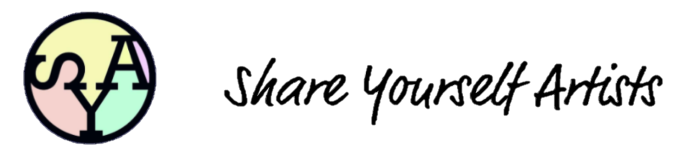
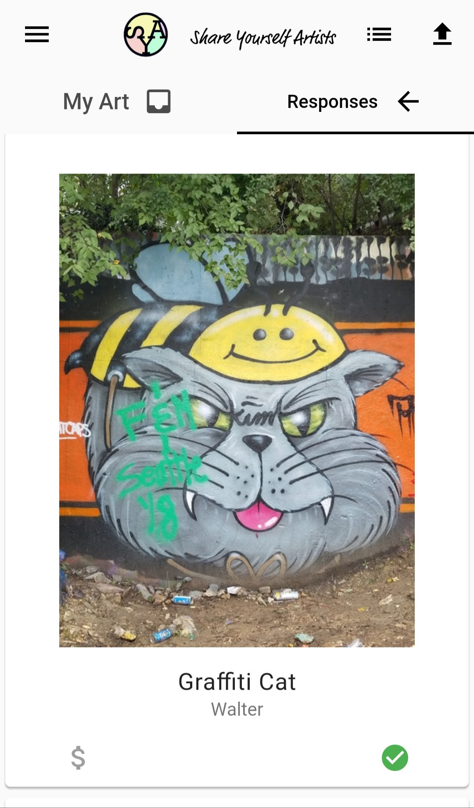

# Share Yourself Artists

The cross-platform mobile application for Share Yourself Artists, powered by Flutter.
Created by Share Yourself Artists Team Flutter, CMPS 115 Fall 2018.



### Prerequisites

Developers are required to download the Flutter mobile application development SDK.

The current version of the mobile application is built with the following dependencies:

* Flutter 0.9.4
* Dart 2.1.0-dev.5.0

Run `flutter --version` in a bash shell to verify the correct versions.

The application has not been tested with newer or older versions of the Flutter SDK and Dart language.


### Building the Application

To build the application for either platform, run `flutter build ios` or `flutter build apk` from the root of the project directory.

To run the application on either platform, run `flutter run`. Developers need to either download the Android Emulator & SDK and/or Xcode,
or plug in their device to run the application.

Windows, Linux, and Mac OS can be used for development. However, the application can only be ran on the Android Emulator for Windows/Linux users,
while Mac OS users can run the application on both platforms.

If an error is encountered during build or run time, try running `flutter clean` and rebuilding the application.

### Coding Standards

`Dartfmt` is the default coding standard included in the Dart SDK. All `dart` files for this application
correspond to this style guide.

Developers can use the `Dartfmt` coding standard with the IDE of their choice. For example,
Intellij developers can turn it on by selecting:

```
Preferences... > Editor > Code Style > Dart > Use the dartfmt tool when formatting the whole file
```

For more information, refer to the official [Dart Style]("https://github.com/dart-lang/dart_style") guide.

### Contributors

CMPS 115 Fall 2018 - TA: Dylan
* Alexis Mabugat
* Yifu (David) Lang
* Franz Hampp
* Ryan Bautista


### Demo

[Full Demo Video](https://www.youtube.com/watch?v=LgeyI5OQRD0)



